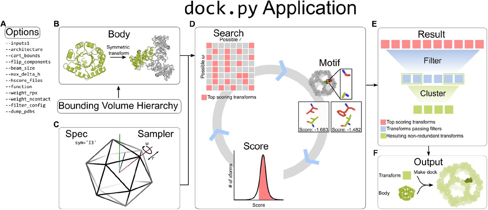

*******
RPXDock
*******

Version 2 of the venerable tcdock and rpxdock programs in rosetta. This version will be faster, simpler, and mostly in python.

    
Read `RPXDock preprint <https://www.biorxiv.org/content/10.1101/2022.10.25.513641v1>`_.

To run RPXDock, clone this github repo and set up a proper conda environment using the `environment.yml` file. Note that a user must obtain a pyrosetta license (free for non-profit users) and update the username and password fields for their pyrosetta license in the environment.yml file before creating the environment. Users may need to also install additional packages in their conda environment such as pyyaml and `willutil <https://github.com/willsheffler/willutil>`_ to properly build the application. To build and compile the codebase with the newly created conda environment, a user may simply run the pytest command using a gcc>9-compatible compiler. To verify that the code compiled properly, execute rpxdock/app/dock.py –-help in the new conda environment. The output should provide a list of options that are relevant for docking. 

Useful scripts:
###############
 * ``app/dock.py`` - the main script to initialize and run protein docking 
 * ``filters.yml`` - Example filter parameters passed in as RPXDock ``--filters`` flag
 * ``app/options.py`` - List of input parameters, descriptions, and default values
 * ``tools/dock.sh`` - simple docking example to execute RPXDock
 * ``tools/dump_pdb_from_output.py`` - Output pdb from RPXDock tarball or pickle files
 * ``tools/rpxdock_to_design.sh`` - simple example for using RosettaScripts to design RPXDock outputs
 * ``tools/rpxdock_to_design.xml`` - simple xml file used for RosettaScripts to design RPXDock outputs 
 * ``tools/symdef/*.sym`` - symmetry definition files for polyhedral architectures

Input preparation for RPXDock:
##############################

Example input pdb files are provided in ``tools/input/scaffolds/*.pdb``. Input .pdb files are provided to the dock.py application using the `--inputs1` option. The input can be a path to a single .pdb (e.g., example.pdb) file, or a path with a wildcard (e.g., `/path/to/files/*.pdb`) can be supplied for multiple inputs. For multicomponent docking, additional inputs can be provided using the `--inputs2` and `--inputs3` option as necessary. For trajectories with multiple input lists provided to `--inputs[n]`, each object in the list will be sampled against every other object in a partner list. The results for list inputs are batched and ranked together against one another. Thus, the “top” results may not include representatives from every input .pdb. If results from every input are desired, the user can either analyze the entire output list or execute each input or pair of inputs in separate RPXDock trajectories.

To dock two distinct monomers asymmetrically or to form cyclic oligomers, monomeric building blocks should have their center of mass at [0,0,0]. RPXDock will not center the inputs by default, but the `--recenter_input` option can be passed to translate a monomeric building block such that its center of mass is at [0,0,0]. The final transform values reported are relative to the recentered pose, so it is recommended that inputs are pre-centered if the user plans to use these values.

To form dihedral, stacking, wallpaper, and polyhedral group symmetries such as tetrahedral, octahedral, and icosahedral architectures, the input building blocks must be cyclic oligomers. The input .pdb files must be pre-aligned such that their internal rotational symmetry axes are aligned to the Z axis and the center of mass of the oligomer should be centered at [0,0,0]. It is important to note that the input .pdb files should only contain the asymmetric unit (asu) of the cyclic oligomer rather than the full symmetric building block, as RPXDock will generate the symmetry-related chains. Currently, dihedral docking only supports one-component (i.e., homomeric) architectures; stacking supports two-component architectures; polyhedral group docking supports one-, two-, and three-component architectures; and wallpaper docking supports two- and three-component architectures.

